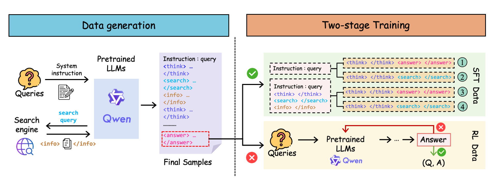
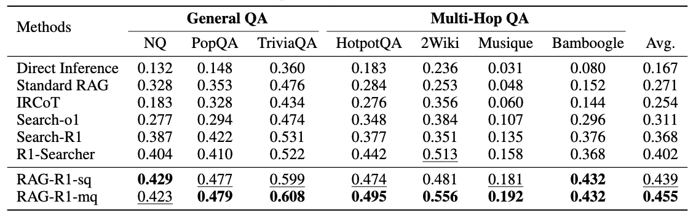

<h1 align="center">RAG-R1 : Incentivize the Search and Reasoning Capabilities of LLMs through Multi-query Parallelism</a></h1>


<div align="center">
<a href="./LICENSE"></a>
<a href="./LICENSE"></a>
<a href="https://huggingface.co/collections/endertzw/rag-r1-68481d7694b3fca8b809aa29"></a>
<a href="https://arxiv.org/abs/" target="_blank"></a>
</div>


<h5 align="center"> If you like our project, please give us a star ⭐ on GitHub for the latest update.</h5>

# ✨ News
[2025/07/01] 🔥🔥🔥[**RAG-R1**](https://github.com/inclusionAI/AgenticLearning/blob/main/RAG-R1/README.md) We propose **RAG-R1**, a deepsearch training framework that incentivizing the search and reasoning capabilities of LLMs through multi-query parallelism.

# 💡 Overview
**RAG-R1** is a deepsearch training framework designed to enable LLMs to adaptively leverage internal and external knowledge during the reasoning process. 
We further expand the generation and retrieval processes within the framework from single-query mode to multi-query parallelism, aimed at reducing inference time and enhancing the model's capabilities.
Extensive experiments on seven question-answering benchmarks demonstrate that our method outperforms the strongest baseline by up to 13.2% and decreases inference time by 11.1%.
- Paper: [arxiv]()
- Model: [huggingface](https://huggingface.co/collections/endertzw/rag-r1-68481d7694b3fca8b809aa29)
- Dataset: [KILT](https://modelscope.cn/datasets/yaoyueduzhen/KILT)

# 🌐 Framework

<h5 align="center"> Overall framework of RAG-R1.</h5>

# 🏆 Performance
## Main Results

<h5 align="left">Performance comparisons on QA benchmarks under the EM metric. The best and second
best results are bold and underlined, respectively.</h5>

# 🛠 Dependencies
We train our model based on python==3.10.13, torch==2.4.0 and cuda==12.1.105.
To begin using this repo, you need to install the required dependencies.
```bash
pip install -r requirements.txt
```

# 🚀 Quick Start
Train a reasoning + search LLM on our dataset with [BGE-large-en-v1.5](https://huggingface.co/BAAI/bge-large-en-v1.5) as the retriever and Wikipedia corpus released by [KILT](https://github.com/facebookresearch/KILT) in August 2019 as the corpus.

(1) Download the index and corpus.

You can build the corpus and index using the following commands or directly download the corpus and index we have constructed.
```bash
## Process wiki full texts
cd RAG-R1/data/kilt
wget http://dl.fbaipublicfiles.com/KILT/kilt_knowledgesource.json

## Build corpus and index
cd RAG-R1/scripts/build_corpus
python split_kilt_to_100.py
## We divided the corpus into 10 parts and built indexes separately for each to prevent memory overflow.
python build_corpus_embedding.py
python build_corpus_index.py
```

You can also download the corpus and index chunks we have built [here](https://modelscope.cn/datasets/yaoyueduzhen/KILT) and run following commands to merge the indexes. 
```bash
cd RAG-R1/scripts/build_corpus
python build_corpus_index.py
```

(2) Launch a local retrieval server.
```bash
python start_retrieval.py
```

(3) Run SFT training with Qwen2.5-7b-instruct.

The SFT training data are available in the data/SFT directory. We recommend using the [LLaMA-Factory](https://github.com/hiyouga/LLaMA-Factory) framework for SFT training.

(4) Run RL training(PPO) with SFT model or Qwen2.5-7b-instruct.
```bash
## prepare RL training data
cd RAG-R1/scripts/data_process
##  single-query mode RL data
python hotpotqa_search.py
##  multi-query parallelism RL data
python hotpotqa_search_mq.py

cd RAG-R1
## run single-query mode RL training
bash train_ppo.sh
## run multi-query parallelism RL training
bash train_ppo_mq.sh
```
For single-query mode training, you need to replace the content of rag_r1/llm_agent/generation.py with the content of rag_r1/llm_agent/generation_sq.py.


# 🙏 Acknowledgements
RAG-R1 is inspired by [Deepseek-R1](https://github.com/deepseek-ai/DeepSeek-R1) with its implementation based on [veRL](https://github.com/volcengine/verl) and [Search-r1](https://github.com/PeterGriffinJin/Search-R1). We deeply appreciate the contributions of these teams to open-source research and development.

# ✍️ Citation
Please cite our repo if our works are helpful for your research.
```
```

# 📧 Contact
For any question or feedback, please reach out to us at [ender.tzw@antgroup.com](mailto:ender.tzw@antgroup.com).

# 📄 License
This project is licensed under the MIT License - see the [LICENSE](LICENSE) file for details.
