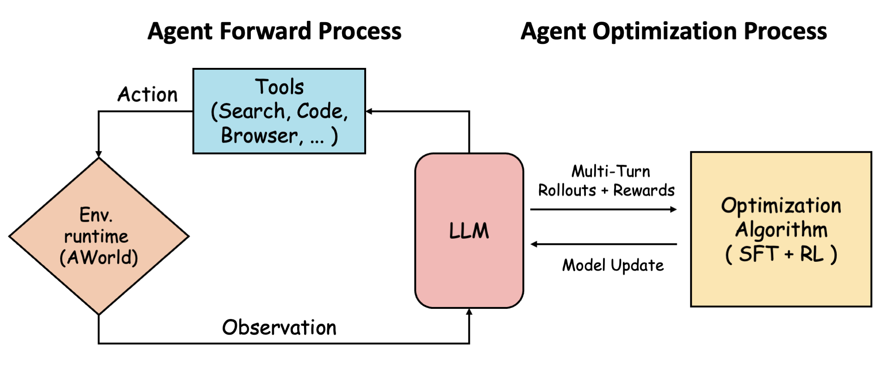

# AgenticLearning

## Introduction
Agent exhibits powerful capabilities by interacting with the external environment and making decisions based on the feedback it receives from the environment. 
For complex problems, it is often necessary for an agent to have multi-turn interactions with the environment to reach a solution. The complexity and dynamism of environments, coupled with the necessity for multi-turn interactions, pose numerous challenges in training agents.

We introduce **AgenticLearning**, an open-source agent training paradigm designed to empower researchers to train and evaluate autonomous agents effectively. AgenticLearning offers a framework for multi-turn interactions with the environment, enabling models to learn how to interact with the environment and make decisions based on its feedback, thereby enhancing the models' ability to leverage the environment to solve complex problems.

## News
[2025/07/01] 🔥🔥🔥We propose **RAG-R1**, a deepsearch training framework that incentivizing the search and reasoning capabilities of LLMs through multi-query parallelism.

## Advancements
### Deepsearch
#### [RAG-R1](RAG-R1/README.md)
- environment: Search Engines (offline or [online](https://github.com/qingw-dev/aworld-mcp-servers))
- LLM: Qwen2.5-7b-instruct

Overall framework of RAG-R1

Performance comparisons on QA benchmarks under the EM metric. The best and second
best results are bold and underlined, respectively.

### FunctionCall

## License
This project is licensed under the MIT License - see the [LICENSE](LICENSE) file for details.

## Contact
For any question or feedback, please reach out to us at [ender.tzw@antgroup.com](mailto:ender.tzw@antgroup.com) or [chenyi.zcy@antgroup.com](mailto:chenyi.zcy@antgroup.com)