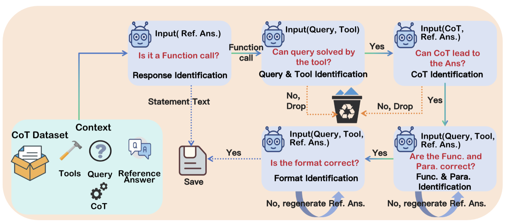
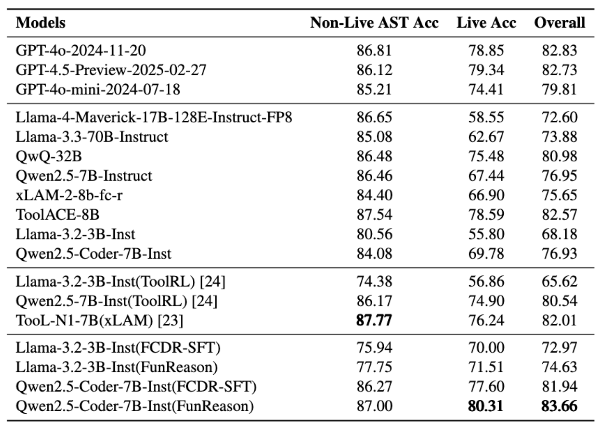

# AgenticLearning

## Introduction

Agent exhibits powerful capabilities by interacting with the external environment and making decisions based on the feedback it receives from the environment.
For complex problems, it is often necessary for an agent to have multi-turn interactions with the environment to reach a solution. The complexity and dynamism of environments, coupled with the necessity for multi-turn interactions, pose numerous challenges in training agents.

We introduce **AgenticLearning**, an open-source agent training paradigm designed to empower researchers to train and evaluate autonomous agents effectively. AgenticLearning offers a framework for multi-turn interactions with the environment, enabling models to learn how to interact with the environment and make decisions based on its feedback, thereby enhancing the models' ability to leverage the environment to solve complex problems.


## News

[2025/07/01] 🔥🔥🔥[**RAG-R1**](https://github.com/inclusionAI/AgenticLearning/blob/main/RAG-R1/README.md) We propose **RAG-R1**, a deepsearch training framework that incentivizing the search and reasoning capabilities of LLMs through multi-query parallelism.

[2025/05/16] 🔥🔥🔥[**FunReason**](https://github.com/inclusionAI/AgenticLearning/blob/main/RAG-R1/README.md) We propose **FunReason**, a novel framework that enhances LLMs' function calling capabilities through an automated data refinement strategy and a Self-Refinement Multiscale Loss approach.

## Advancements

### Deepsearch

#### [RAG-R1](RAG-R1/README.md)

- environment: Search Engines (offline or [online](https://github.com/qingw-dev/aworld-mcp-servers))
- LLM: Qwen2.5-7b-instruct


<h5 align="center">Overall framework of RAG-R1.</h5>


<h5 align="left">Performance comparisons on QA benchmarks under the EM metric. The best and second
best results are bold and underlined, respectively.</h5>

### FunctionCall

#### [FunReason](https://github.com/BingguangHao/FunReason/)

FunReason, a novel framework with SRML approach specifically designed to enhance the function calling capabilities of LLMs. Through extensive experiments on the BFCL benchmark, we demonstrate that our FunReason achieves performance comparable to GPT-4o, surpassing existing RL-based methods. Furthermore, our approach effectively mitigates the critical issue of catastrophic forgetting during fine-tuning, as evidenced by the results on the HumanEval and MBPP code benchmarks. Complementing our loss function, we developed a comprehensive data refinement strategy that leverages LLMs to automatically evaluate and improve the quality of function calling data. Notably, our findings indicate that naturally generated CoT data from reasoning models outperforms artificially constructed CoT based on predefined strategies.



<h5 align="center">Data refinement pipline of FunReason.</h5>

**Overview of FunReason's data refinement pipeline.** The pipeline consists of five stages: Function Call Classification, Query and Tool Identification, CoT Identification, Function and Parameter Identification, and Format Identification. Each stage ensures specific aspects of data quality, with failing examples either being discarded or regenerated.




<h5 align="center">Performance of FunReason.</h5>

### Citation

Please cite our repo if our works are helpful for your research.

```

```

## Contact

For any question or feedback, please reach out to us at [ender.tzw@antgroup.com](mailto:ender.tzw@antgroup.com) or [chenyi.zcy@antgroup.com](mailto:chenyi.zcy@antgroup.com)

## License

This project is licensed under the MIT License - see the [LICENSE](LICENSE) file for details.
