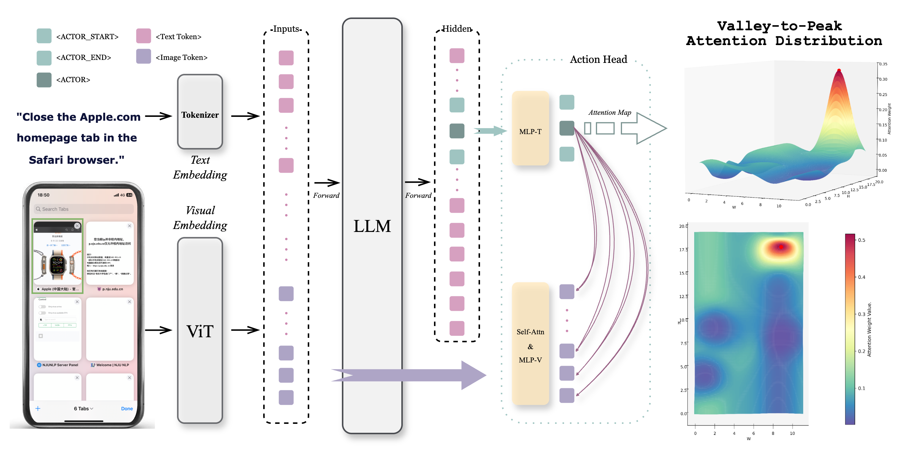

# AgenticLearning

## Introduction

Agent exhibits powerful capabilities by interacting with the external environment and making decisions based on the feedback it receives from the environment.
For complex problems, it is often necessary for an agent to have multi-turn interactions with the environment to reach a solution. The complexity and dynamism of environments, coupled with the necessity for multi-turn interactions, pose numerous challenges in training agents.

We introduce **AgenticLearning**, an open-source agent training paradigm designed to empower researchers to train and evaluate autonomous agents effectively. AgenticLearning offers a framework for multi-turn interactions with the environment, enabling models to learn how to interact with the environment and make decisions based on its feedback, thereby enhancing the models' ability to leverage the environment to solve complex problems.


| Advancements  |  Models |                                         Tools                                         |                   Environment                   |                                                                    Training Framework                                                                    |
|:---------------------------------------------------------------------------------------:|:-------------------------:|:-------------------------------------------------------------------------------------:|:-----------------------------------------------:|:--------------------------------------------------------------------------------------------------------------------------------------------------------:|
|               [**V2P**](https://github.com/inclusionAI/AgenticLearning/blob/main/V2P/README.md)                | Qwen2.5-7b-instruct |                           Click                           | [AWorld](https://github.com/inclusionAI/AWorld) |                 [Transformers](https://github.com/huggingface/transformers) 
| [**RAG-R1**](https://github.com/inclusionAI/AgenticLearning/blob/main/RAG-R1/README.md) |    Qwen2.5-7b-instruct    | offline retrieval<br>[online search](https://github.com/qingw-dev/aworld-mcp-servers) | [AWorld](https://github.com/inclusionAI/AWorld) | [LLaMA-Factory](https://github.com/hiyouga/LLaMA-Factory)<br>[verl](https://github.com/volcengine/verl)<br>[AReaL](https://github.com/inclusionAI/AReaL) |
|               [**FunReason**](https://github.com/BingguangHao/FunReason/)               | Qwen2.5-7b-Coder-instruct |                                       [BFCL](https://gorilla.cs.berkeley.edu/leaderboard.html#leaderboard)                                        | [AWorld](https://github.com/inclusionAI/AWorld) |                                                        [LLaMA-Factory](https://github.com/hiyouga/LLaMA-Factory)<br>[verl](https://github.com/volcengine/verl)                                                        |
                                                

## News
[2025/08/19] 🔥🔥🔥[**V2P**](https://github.com/inclusionAI/AgenticLearning/blob/main/V2P/README.md) We propose **V2P**, a novel training method for multi-modal models that enables coordinate-free, human-like visual GUI Grounding.

[2025/07/01] 🔥🔥🔥[**RAG-R1**](https://github.com/inclusionAI/AgenticLearning/blob/main/RAG-R1/README.md) We propose **RAG-R1**, a deepsearch training framework that incentivizing the search and reasoning capabilities of LLMs through multi-query parallelism.

[2025/05/16] 🔥🔥🔥[**FunReason**](https://github.com/BingguangHao/FunReason/) We propose **FunReason**, a novel framework that enhances LLMs' function calling capabilities through an automated data refinement strategy and a Self-Refinement Multiscale Loss approach.

## Advancements
### GUI Navigation
#### [V2P](https://github.com/inclusionAI/AgenticLearning/blob/main/V2P/README.md) 

- Tools: Click
- LLM: Qwen2.5-7b-instruct



<h5 align="center">Overall framework of V2P.</h5>


<h5 align="center">Performance on both SreenSpot-v2 (left) and ScreenSpot-Pro (right).</h5>
  

### Deepsearch

#### [RAG-R1](RAG-R1/README.md)

- Tools: Search Engines (offline or [online](https://github.com/qingw-dev/aworld-mcp-servers))
- LLM: Qwen2.5-7b-instruct


<h5 align="center">Overall framework of RAG-R1.</h5>


<h5 align="left">Performance comparisons on QA benchmarks under the EM metric. The best and second
best results are bold and underlined, respectively.</h5>

### FunctionCall

#### [FunReason](https://github.com/BingguangHao/FunReason/)

- Tools: Real Human Function calling (BFCLv2 live&non-live)
- LLM: Qwen2.5-7b-Coder-instruct

FunReason is a framework designed to enhance LLMs' function calling capabilities, achieving GPT-4o-comparable performance on BFCL, surpassing RL-based methods, mitigating catastrophic forgetting on HumanEval and MBPP, and using a data refinement strategy where natural CoT data outperforms artificial ones.


<h5 align="center">Data refinement pipline of FunReason.</h5>

**Overview of FunReason's data refinement pipeline.** The pipeline consists of five stages: Function Call Classification, Query and Tool Identification, CoT Identification, Function and Parameter Identification, and Format Identification. Each stage ensures specific aspects of data quality, with failing examples either being discarded or regenerated.


<h5 align="center">Performance of FunReason.</h5>

### Citation

Please cite our repo if our works are helpful for your research.
```
@article{RAG-R1,
  title={RAG-R1 : Incentivize the Search and Reasoning Capabilities of LLMs through Multi-query Parallelism}, 
  author={Zhiwen Tan and Jiaming Huang and Qintong Wu and Hongxuan Zhang and Chenyi Zhuang and Jinjie Gu},
  journal={arXiv preprint arXiv:2507.02962},
  year={2025}
}

@article{FunReason,
  title={FunReason: Enhancing Large Language Models' Function Calling via Self-Refinement Multiscale Loss and Automated Data Refinement},
  author={Bingguang Hao, Maolin Wang, Zengzhuang Xu, Cunyin Peng, Yicheng Chen, Xiangyu Zhao, Jinjie Gu, Chenyi Zhuang},
  journal={arXiv preprint arXiv:2505.20192},
  year={2025}
}
```

## Contact

For any question or feedback, please reach out to us at [ender.tzw@antgroup.com](mailto:ender.tzw@antgroup.com) or [chenyi.zcy@antgroup.com](mailto:chenyi.zcy@antgroup.com)

## License

This project is licensed under the MIT License - see the [LICENSE](LICENSE) file for details.
