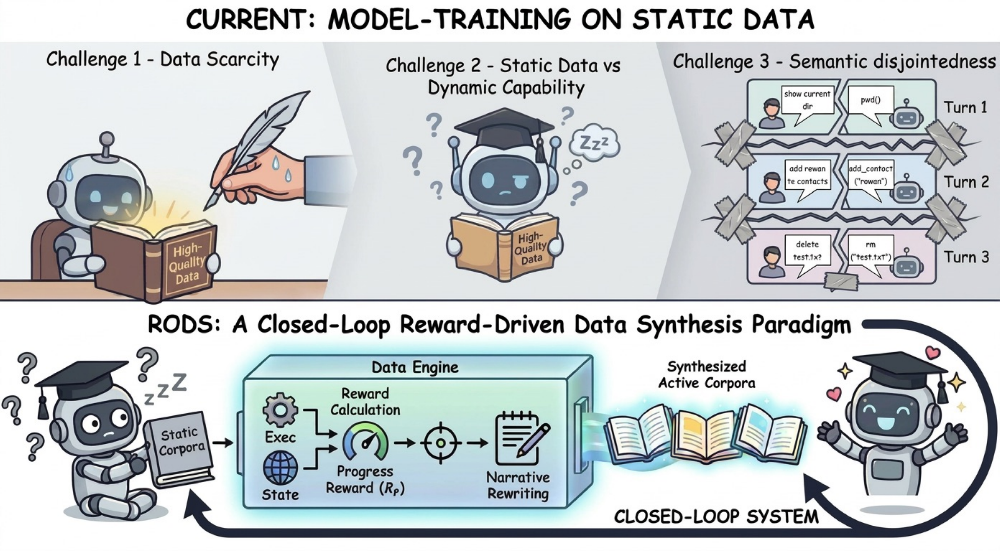
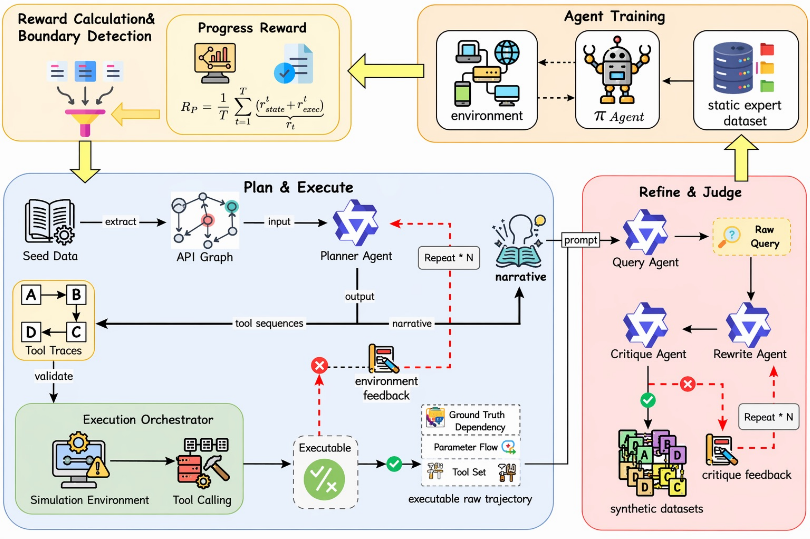
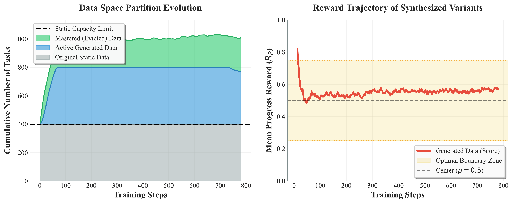
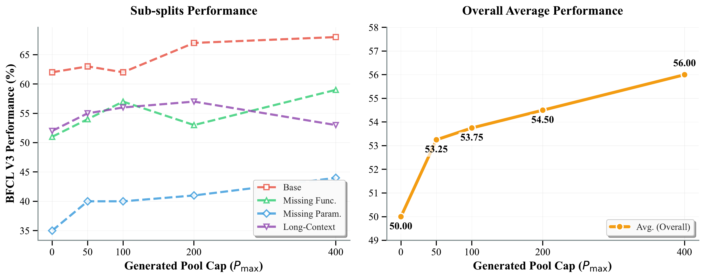

<div align="center">

# RODS: Reward-Driven Online Data Synthesis <br> for Multi-Turn Tool-Use Agents

[](https://arxiv.org/abs/2606.19047)
[](https://huggingface.co/papers/2606.19047)
[](https://huggingface.co/RuishanFang/Qwen3-4B-RODS)
[](https://github.com/inclusionAI/AWorld-RL/tree/main/RODS)

</div>

## Introduction

Multi-turn tool-use RL is bottlenecked by the rapid depletion of informative samples in static datasets. We observe that the gradient signal in GRPO concentrates on tasks with the highest rollout reward variance — a consequence of the Popoviciu upper bound. Samples near the agent's **capability boundary** (where successes and failures are roughly balanced) contribute disproportionately large policy gradients. As training progresses, this boundary continuously shifts, gradually depleting the pool of informative samples.

We propose **RODS** (**R**eward-driven **O**nline **D**ata **S**ynthesis) to resolve this depletion. RODS closes the loop between RL training and data generation by repurposing the progress reward variance as a practical, zero-cost boundary detector. It continuously identifies boundary samples, synthesizes new multi-turn variants matching their structural complexity via a skill-aligned resampling pipeline, and manages a dynamic replay buffer that co-evolves with the policy.

<div align="center">
  
</div>

Starting from **400 human seeds** and maintaining an active training pool of **~800 samples**, RODS achieves comparable performance to a 17K-sample offline pipeline while requiring roughly **20x fewer trajectories**, and improves over fixed-data RL and environment augmentation in our controlled setting.

## Method

RODS maintains a saturated learning signal through three co-evolving modules:

1. **Reward-Based Seed Detection**: Identifies high-variance boundary tasks using the average Progress Reward across rollouts, partitioning the task space into mastered, boundary, and hard regions.
2. **Skill-Aligned Data Synthesis**: A five-stage multi-agent pipeline (Plan → Execute → Rewrite → Critique → Augment) transforms boundary seeds into novel, structurally valid variants that preserve the informative complexity of the original task.
3. **Dynamic Replay Buffer Management**: A dual-control lifecycle with staged injection and multi-layer retirement tracks the shifting capability boundary.

<div align="center">
  
</div>

## Results

<details open>
<summary><b>In-Distribution Performance (BFCL V3)</b></summary>

All RL methods share the same 400 training samples and GRPO setup. RODS achieves the highest overall scores across three model families.

| Model | Overall | Base | Miss Func | Miss Param | Long Context |
|---|---|---|---|---|---|
| GPT-4o-2024-11-20 | 42.50 | 55.50 | 34.50 | 29.00 | 51.00 |
| DeepSeek-V3.2-Exp | 44.88 | 55.00 | 49.00 | 27.00 | 48.50 |
| FunReason-MT-4B (17K offline) | 56.50 | 63.00 | 53.00 | 40.00 | 55.00 |
| Qwen3-4B-Instruct | 22.13 | 26.50 | 21.00 | 15.50 | 25.50 |
| &nbsp;&nbsp;+ Static dataset | 50.00 (+27.87) | 62.00 | 51.00 | 35.00 | 52.00 |
| &nbsp;&nbsp;+ EnvTuning | 50.50 (+28.37) | 64.00 | 52.00 | 35.00 | 51.00 |
| &nbsp;&nbsp;+ **RODS (ours)** | **56.00 (+33.87)** | **68.00** | **59.00** | **44.00** | **53.00** |

On Qwen3-4B-Instruct, RODS improves overall multi-turn performance by **+33.87%** (reaching 56.00%), surpassing both the static dataset baseline (50.00%) and EnvTuning (50.50%), and matching the large-scale FunReason-MT-4B pipeline that uses **20x more data**.

</details>

<details>
<summary><b>Mechanism Validation: Data Space Evolution</b></summary>

<div align="center">
  
</div>

- **(Left)** RODS breaks the static capacity limit by continuously synthesizing active boundary data and evicting mastered tasks.
- **(Middle)** Newly synthesized variants land inside the boundary zone, confirming successful targeting of the capability frontier.
- **(Right)** Rollout reward variance in the boundary zone is 2.0–2.2x higher than in mastered or hard regions.

</details>

<details>
<summary><b>Data Scaling Analysis</b></summary>

<div align="center">
  
</div>

Even a small boundary expansion (P_max=50, ~12% expansion) yields meaningful improvement. Boundary-targeted data has significantly higher per-sample training value than uniformly sampled data.

</details>

<details>
<summary><b>Out-of-Distribution Generalization</b></summary>

RODS generalizes robustly to OOD tasks (BFCL V4, tau2-bench, ACEBench Agent). On Llama-3.1-8B-Instruct:

| Benchmark | Base Model | + EnvTuning | + RODS (ours) |
|---|---|---|---|
| BFCL V4 Avg. | 7.05 | 16.53 | **18.00** |
| tau2-bench Avg. | 19.46 | 22.17 | **25.00** |
| ACEBench Agent Avg. | 4.15 | 8.82 | **11.15** |

</details>

## Citation

```bibtex
@article{fang2026rods,
  title={RODS: Reward-Driven Online Data Synthesis for Multi-Turn Tool-Use Agents},
  author={Fang, Ruishan and Lu, Siyuan and Zhuang, Chenyi and Lin, Tao},
  journal={arXiv preprint arXiv:2606.19047},
  year={2026}
}
```

