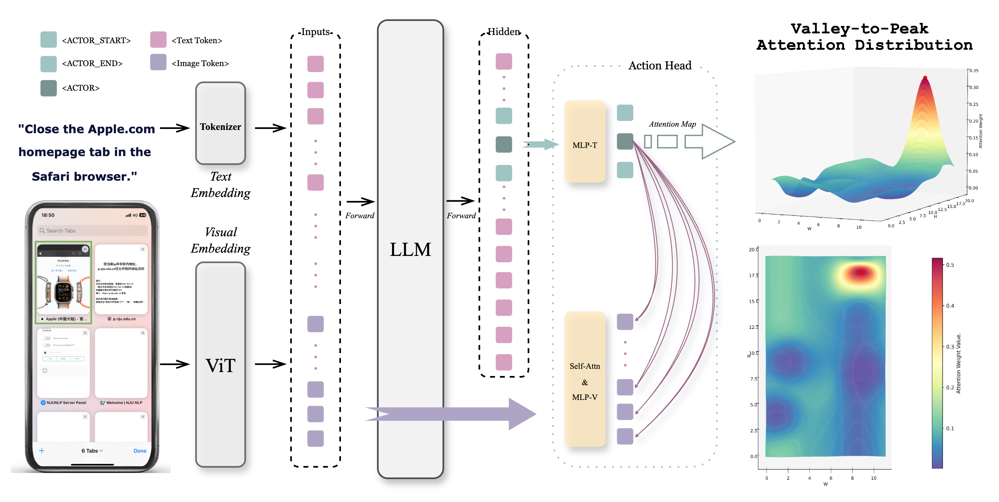

<h1 align="center">V2P: FROM BACKGROUND SUPPRESSION TO CENTER PEAKINGFOR ROBUST GUI GROUNDING TASK</h1>

<div align="center">
<a href="./LICENSE"></a>
<a href="./LICENSE"></a>
<a href="https://huggingface.co/Minstrel54524/V2P-7B"></a>
<a href="https://arxiv.org/abs/2508.13634" target="_blank"></a>
</div>

<h5 align="center"> If you like our project, please give us a star ⭐ on GitHub for the latest update.</h5>


# ✨ News

[2025/08/19] 🔥🔥🔥[**V2P**](https://github.com/inclusionAI/AgenticLearning/blob/main/V2P/README.md) We propose **V2P**, a novel training method for multi-modal models that enables coordinate-free, human-like visual GUI Grounding.

# 💡 Overview

**Valley-to-Peak (V2P)** is a novel training method for precise GUI element localization. Unlike traditional approaches relying on coarse bounding boxes or center-point regression, V2P addresses spatial uncertainties and visual-semantic hierarchies in GUI tasks. Also, by introducing a suppression attention mechanism and Fitts’ Law-inspired Gaussian heatmap labels, V2P both minimizes distractions from background regions and distinguishes between element centers and edges. Evaluated on the ScreenSpot-v2 and ScreenSpot-Pro benchmarks, V2P achieves **92.3%** and **50.5%** accuracy, respectively.

- Paper: [arxiv](https://arxiv.org/abs/2508.13634)
- Model: Coming Soon...
- Dataset: Coming Soon...

<!-- - Model: [huggingface](加入huggingface链接)
- Dataset: [DATA](加入huggingface链接) -->

# 🌐 Framework



<h5 align="center"> Fig. 1 Overall framework of V2P.</h5>

# 🏆 Performance

## Main Results


<h5 align="center">Fig. 2 Performance on both SreenSpot-v2 (left) and ScreenSpot-Pro (right).</h5>

# 🛠 Dependencies

To begin using this repo, you need to create a conda environment and install the required dependencies.

```bash
conda create -n v2p python=3.10
conda activate v2p
conda install pytorch torchvision torchaudio pytorch-cuda -c pytorch -c nvidia
pip install -e .
```

# 📊 Data Preparation

To train the V2P-7B model, please download the data from [here](https://huggingface.co/datasets/cckevinn/GUI-Actor-Data), which is organized by the GUI-Actor Team. And also download the [cleaned data](https://github.com/Yan98/GTA1/tree/main/preprocessing) processed by GTA1 Team. We are grateful to both teams for openly sharing their datasets.

After downloading, please place the original GUI-Actor data in `data/datasets/` and the cleaned datasets in `data/cleaned_datasets/`.

# 🚀 Model Training

**1. Warmup stage:**

```bash
bash scripts/warmup.sh
```

**2. Warmup stage:**

```bash
bash scripts/train.sh
```

# 💯 Inference and Evaluation

For inference stage, please first download the ScreenSpot-v2 and ScreenSpot-Pro datasets from their official website, place them in `eval/eval_datasets`, and then run these command:

```bash
bash eval/eval_scripts_for_v2.sh
bash eval/eval_scripts_for_pro.sh
```

# 🌟 Future Work

Our future work will be integrated into the [AWorld](https://github.com/inclusionAI/AWorld) framework under the *Multi-Modal* category, enhancing Agent capabilities in advanced OS and web interactions through more precise GUI grounding.

# 🙏 Acknowledgements

V2P is inspired by [GUI-Actor](https://github.com/microsoft/GUI-Actor). We deeply appreciate the contributions of the team of GUI-Actor to open-source their research. Their efforts in curating and sharing high-quality datasets and code resources have greatly advanced research in this field and enabled our work. We extend our sincere gratitude to the entire GUI-Actor team for their dedication to the community.

# ✍️ Citation

Please cite our repo if our works are helpful for your research.

```
@misc{chen2025v2pbackgroundsuppressioncenter,
      title={V2P: From Background Suppression to Center Peaking for Robust GUI Grounding Task},
      author={Jikai Chen and Long Chen and Dong Wang and Leilei Gan and Chenyi Zhuang and Jinjie Gu},
      year={2025},
      eprint={2508.13634},
      archivePrefix={arXiv},
      primaryClass={cs.AI},
      url={https://arxiv.org/abs/2508.13634},
}
```

# 📧 Contact

For any question or feedback, please reach out to us at [chenjikai.cjk@antgroup.com](chenjikai.cjk@antgroup.com).

# 📄 License

This project is licensed under the MIT License - see the [LICENSE](LICENSE) file for details.
